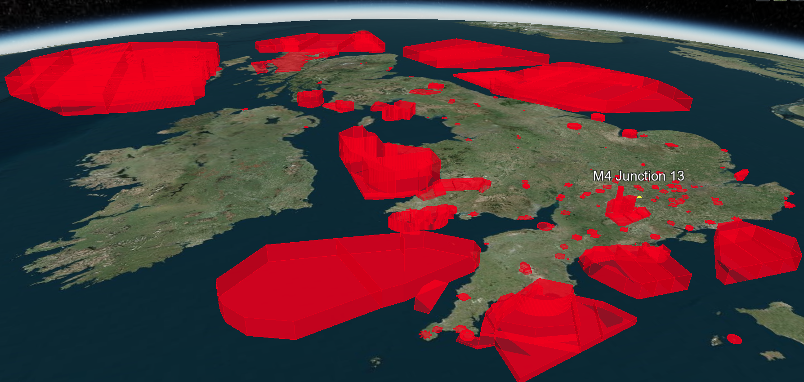
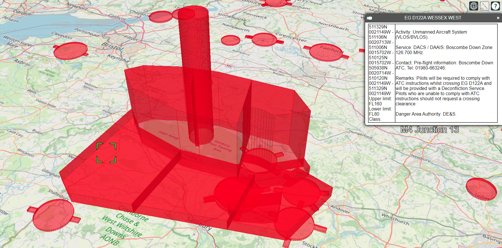

# 3D Visualisation of UK No-Fly Zones
A browser-based 3D map to explore UK government defined no-fly zones:

# Sources/Research
- https://www.dji.com/uk/flysafe/geo-map  
  DJI’s GEO System delineates where it is safe to fly, where flight may raise concerns, and where flight is restricted. GEO zones that prohibit flight are implemented around locations such as airports, power plants, and prisons. They are also implemented temporarily around major stadium events, forest fires, or other emergency situations. Certain GEO zones don’t prohibit flight, but do trigger warnings that inform users of potential risks.
- **Civil Aviation Authority (CAA)**:  
  - https://register-drones.caa.co.uk/drone-code/where-you-can-fly
  - https://www.caa.co.uk/drones/
- **NATS: UAS Restriction Zones**
  - https://nats-uk.ead-it.com/cms-nats/opencms/en/uas-restriction-zones/
  - Digital Datasets: [KMZ File](https://nats-uk.ead-it.com/cms-nats/opencms/en/Publications/digital-datasets/drone-map/export-eaip3d-20221229-CRC_094D1EF3.kmz)  
- **Unofficial webisites with 2D representations**:
  - https://www.noflydrones.co.uk/
  - https://www.dronesdirectory.co.uk/no-fly-zones